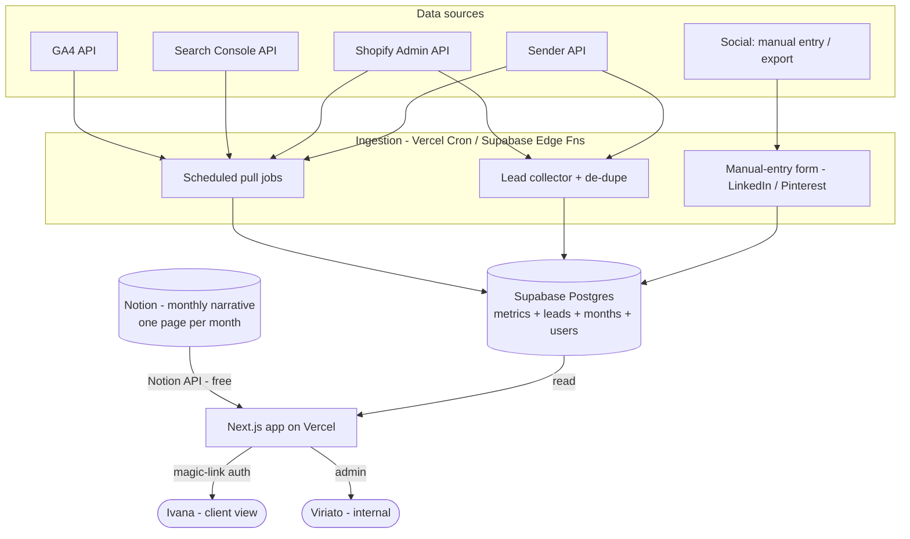

# Monteiro Fabrics — Marketing Dashboard
### Developer brief (v1) — for handoff

**Prepared by:** Viriato (Antonio) · **Client:** Monteiro Fabrics (MF) · **Date:** 3 Jul 2026 · **Status:** Draft for developer handoff

---

## 1. TL;DR

Replace the hand-built monthly PDF report (and the scattered Notion links) with a single **Monteiro-branded web dashboard** that presents a clear, **story-driven monthly marketing report** to Ivana (MF's marketing director), with **month-over-month trends**.

The report is **authored in Notion** each month (by Antonio, Claude-assisted) and **rendered by the app**. Auto-pullable numbers are stored in **Supabase** so trends accumulate over time. Lead data is auto-collected and de-duplicated across Shopify + Sender. Ship a **lean MVP first**, then iterate.

**Stack:** Next.js (Vercel) · Supabase (Postgres + Auth + Storage) · Notion API (headless CMS). All match tools already connected in Antonio's environment.

---

## 2. Background & problem

- **Viriato** is a digital performance-marketing agency. It runs **all** of MF's marketing: the Shopify site + theme, SEO/sector/landing pages, GTM/GA4 tracking, Google Ads, Sender email, social (Instagram/LinkedIn/Pinterest) and design.
- **Monteiro Fabrics** is a Portuguese **B2B performance-fabric / faux-leather manufacturer** (`monteirofabrics.com`, Shopify). Sample-led funnel: product pages priced at €0 to drive free-swatch requests; catalogue/technical-file downloads and contact forms generate leads. ~28 collections, 16 sectors (Healthcare, Marine, Automotive, Hospitality, etc.).
- **Point of contact:** Ivana, MF marketing director.
- **Today's reporting** is a monthly PDF stitched by hand from GA4, Search Console, Google Ads, Sender, Shopify and social exports — slow to produce, hard to compare across months, and (per Antonio) not telling a clear story. Work and feedback are shared as Notion links.

**The pain:** the monthly PDF is a time sink, it's static, and it can't easily show "this month vs last month."

---

## 3. Goals & non-goals

**Goals (v1)**
- Kill the monthly-PDF grind; present the monthly report in the browser.
- Tell a **clear, outcome-first story**, led by SEO/traffic growth (what Ivana cares about most).
- Show **month-over-month comparisons + a running trend** for every key metric.
- Auto-collect and **de-duplicate leads** across Shopify + Sender into one master list.
- Keep **Notion as the authoring tool** (free); the app renders it.
- Carry Viriato's **written analysis** ("quick read" + "recommended actions") in every section.

**Non-goals (explicitly phase 2+)**
- Paid-ads reporting (Google Ads / Meta).
- Social content calendar + approval workflow.
- Website work-log + feedback/change-request workflow.
- Multi-client / white-label.
- Year-over-year comparison (needs 12+ months of history first).

---

## 4. Users & roles

| Role | Who | Access |
| :-- | :-- | :-- |
| **Client viewer** | Ivana (MF) | Read-only. Magic-link login. Sees the published, Monteiro-branded report in **Portuguese**. |
| **Agency admin** | Viriato team (Antonio + designers) | Manage data sources, trigger/refresh pulls, review the Notion-sourced narrative, publish the month, manage the lead list. |

Single tenant (MF) for now — but include a `tenant_id` on core tables so the app can become multi-client later without a rewrite.

---

## 5. Architecture

**Approach:** Notion is the **headless CMS** for narrative; Supabase is the **metrics historian** (one row per metric per month) so comparisons build up; Next.js renders the client-facing report; scheduled jobs handle the auto-pulls.



**Why this stack**
- **Next.js + Vercel:** fast to build, great charts ecosystem, already connected.
- **Supabase:** Postgres for the metrics history, built-in **magic-link auth**, storage for the MF logo/assets, row-level security for the tenant. Already connected.
- **Notion API:** free on every plan (incl. free personal tier); keeps Antonio's Claude-assisted authoring flow intact. No added cost.

---

## 6. Data sources (v1)

| Section | Source | Method | Key metrics | Cadence |
| :-- | :-- | :-- | :-- | :-- |
| Website & SEO | **GA4** (property `524516546`, GTM `GTM-KWHH9H5K`) | Auto (GA4 Data API) | Sessions, users, new users, channel group, source/medium, key pages | Scheduled monthly (+ on-demand) |
| Website & SEO | **Search Console** | Auto (Search Analytics API) | Clicks, impressions, CTR, avg position, top queries/pages, countries | Monthly |
| Website & SEO | **Microsoft Clarity** *(optional v1)* | Auto (Clarity API) or manual highlights | Notable behaviour signals (rage clicks, scroll) | Monthly |
| Social | **Instagram / Facebook** | Auto (Meta Graph API) | Followers, reach, engagement, top posts | Monthly |
| Social | **LinkedIn** | **Manual entry / export** (no clean API) | Followers, impressions, engagement | Monthly |
| Social | **Pinterest** *(optional v1)* | Manual entry | Impressions, saves | Monthly |
| Leads & email | **Sender** | Auto (Sender API) | Subscribers by group/tag, downloads by asset (Mediflex/Electra technical files + catalogues), by country | Monthly |
| Leads & email | **Shopify** | Auto (Admin GraphQL API) | Sample orders (€0), contact-form leads, by country | Monthly |
| Leads & email | **Google Ads leads** *(optional v1)* | Manual or Ads API | `generate_lead` conversions | Monthly |

> Existing Sender download-form IDs (for reference): `e5Prqd`/`eXDvAg` (Mediflex), `aM8KD1`/`b2kPAz` (Electra).

---

## 7. Report structure — the outcome-first story

The report reads top-to-bottom as a narrative. Every section shows **numbers + MoM comparison + a trend line + Viriato's written commentary** (pulled from the month's Notion page).

1. **Headline / outcome** — the month's single biggest win as a hero stat (v1 default: **SEO / traffic growth**), one-line takeaway, and Viriato's framing. This is the "so what."
2. **Website & SEO** — GA4 traffic (sessions, users, channels, source/medium) + Search Console (clicks, impressions, avg position, top queries/pages, countries) + optional Clarity highlights. MoM deltas and sparklines throughout.
3. **Social** — Instagram + LinkedIn (followers, reach, engagement, top posts). Mostly manual inputs.
4. **Leads & email** — the de-duplicated lead list (count, by source, by sector/company where known), Sender downloads by asset, Shopify sample orders by country. **Leads stay visible as the business bottom-line even though SEO leads the headline.**
5. **What we did & what's next** — actions taken this month, wins, and recommended next steps, in Viriato's words.

**Comparison model:** month-over-month **plus** a running trend across every captured month. (YoY added later once history exists.)

**Design intent:** editorial and uncluttered — big hero number, generous whitespace, simple line charts for trends and light bars for breakdowns. Not a dense KPI wall.

---

## 8. Lead collection & de-duplication (automates today's manual check)

This replaces the hand-built `Shopify_vs_Sender_Lead_Check` / `June_2026_Email_Contacts` spreadsheets.

**Inputs:** Shopify (customers + orders + contact-form submissions), Sender (subscribers by group/tag), optionally Google Ads leads.

**Logic**
1. Pull recent records from each source.
2. **De-dupe by normalized email** (lowercase, trim).
3. Merge into one **master lead record**.
4. Exclude anything flagged internal/test.

**Master lead record fields**
`email` (unique key) · `name` · `company` · `sector` · `country` · `created_at` · `sources[]` (shopify / sender / ads) · `sender_origin` + `sender_tags` · `shopify_orders_count` · `marketing_consent` · `confirmation_method` · `is_test`.

**Output:** one clean lead table feeding the Leads section counts and (for the admin view) an exportable list with company/sector where known.

---

## 9. Data model (Supabase) — starting sketch

```
tenants(id, name)                                   -- MF now; enables multi-client later
users(id, email, role[viewer|admin], tenant_id)     -- Supabase Auth (magic link)
months(id, tenant_id, year, month, status[draft|published], published_at)
metrics(id, month_id, source, section, metric_key, value, unit)   -- generic time-series
  -- e.g. (source='ga4', section='seo', metric_key='sessions', value=1240)
leads(id, tenant_id, email UNIQUE, name, company, sector, country,
      created_at, marketing_consent, confirmation_method, is_test)
lead_sources(id, lead_id, source, external_id, tag, first_seen)   -- one lead → many sources
narrative(id, month_id, section, notion_page_id, notion_block_ref, html)  -- pulled from Notion
```

The generic `metrics` table keeps ingestion simple and makes MoM/trend queries uniform (group by `metric_key`, order by month). Section-specific views can sit on top.

---

## 10. Notion integration

- One Notion database **"Monthly Reports"**, **one page per month**, with a **standard template**: a heading per report section (Headline, Website & SEO, Social, Leads, What's next) containing the written analysis.
- The app reads pages via the **Notion API** (free) and maps Notion sections → app sections (`narrative` table).
- **Division of labour:** numbers live in Supabase (auto-pulled, for trends); **narrative lives in Notion** (authored by Antonio + Claude). The app merges the two at render time.
- Antonio standardizes the monthly Notion template so the mapping is reliable (see open questions).

---

## 11. Auth & access

- **Supabase Auth, magic link (passwordless).** Ivana enters her email, clicks the link, sees the report. Nothing to remember.
- Roles: `viewer` (Ivana) and `admin` (Viriato). Admin-only routes for data management + publish.
- Enforce tenant via row-level security now (single tenant), so multi-client is a config change later, not a refactor.

---

## 12. Design & branding

- **Monteiro-branded**: MF logo + palette (assets in `assets-source/logos`). Viriato stays behind the scenes.
- **Portuguese** UI copy (report content is PT; site content stays EN). Build copy as a simple string map so a second language can be added later.
- Editorial, story-first layout (see §7). Fully responsive — Ivana may open it on mobile.

---

## 13. v1 feature checklist (with acceptance criteria)

- [ ] **Magic-link login**; Ivana lands on the latest published month. *AC: unknown emails are rejected; viewer cannot see admin routes.*
- [ ] **Month switcher**; defaults to latest published. *AC: draft months are hidden from the viewer.*
- [ ] **Outcome-first report** rendering the 5 sections. *AC: every section shows value, MoM delta, trend, and its Notion commentary.*
- [ ] **MoM + running-trend charts** from the `metrics` history. *AC: a metric with ≥2 months shows a correct delta and trend line.*
- [ ] **Auto-pull jobs** for GA4, GSC, Shopify, Sender writing into `metrics`. *AC: a manual "refresh" re-pulls the current month.*
- [ ] **Manual-entry form** (admin) for LinkedIn/Pinterest social numbers. *AC: entries appear in the Social section + trend.*
- [ ] **Lead collector + de-dupe** into `leads`. *AC: a lead present in both Shopify and Sender appears once, with both sources; test/internal excluded.*
- [ ] **Notion pull** mapping the month's page into section commentary. *AC: editing Notion + refresh updates the rendered narrative.*
- [ ] **Publish flow** (admin): draft → published. *AC: only published months are visible to Ivana.*
- [ ] **Monteiro branding + PT copy** applied. *AC: matches MF logo/palette; no Viriato branding on the client view.*

---

## 14. Phase 2+ roadmap

1. **PDF export / archive** of a published month (Ivana keeps a formal copy).
2. **Paid-ads module** — Google Ads + Meta, reusing the `metrics` store.
3. **Social content calendar + approvals** — plan/preview posts, Ivana sign-off (replaces Notion-link sharing for content).
4. **Website work-log + feedback** — surface the website change log Viriato already keeps in `mf-knowledge/website/`, and let Ivana file change requests / approvals.
5. **Year-over-year** comparison once 12+ months exist.
6. **Multi-client / white-label** — flip `tenant_id` on; reuse for other Viriato clients.

---

## 15. Open questions / decisions for Antonio

1. **Where does it live?** e.g. `relatorios.monteirofabrics.com` (client-friendly) vs a Viriato subdomain. Affects DNS + branding.
2. **Who enters the manual social numbers** (LinkedIn/Pinterest) each month — Antonio via the admin form?
3. **Google Ads leads** — fold into the lead de-dupe now, or phase 2?
4. **Notion template** — OK to standardize a fixed monthly template so the section mapping is reliable?
5. **Clarity** — include behavioural highlights in v1, or skip for now?
6. **Budget / developer** — fixed-scope freelancer vs ongoing? Influences how much of phase 2 to design up front.
7. **Brief language** — hand the developer this English version, or a Portuguese translation?

---

## 16. Suggested milestones (lean MVP)

- **M1 — Foundations:** Supabase schema + magic-link auth + Notion pull + **Website & SEO** section live with MoM/trend.
- **M2 — Data breadth:** Lead collector + de-dupe + **Leads** section; **Social** section with manual entry + Meta pull.
- **M3 — Story + polish:** Headline/hero + "what's next", Monteiro branding, PT copy, publish flow. Ship to Ivana.

*Phase 2 items (PDF export, paid ads, approvals, website feedback) scoped after M3 based on how Ivana uses v1.*
